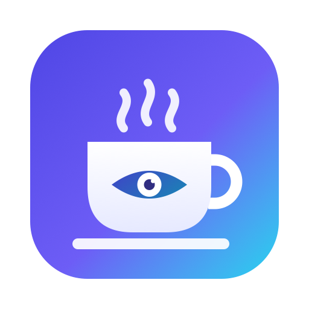

<p align="center">
  
</p>

<h1 align="center">KeepMeUp</h1>

<p align="center">
  A free, open-source menu bar app that keeps your Mac awake, and lets you control it from Telegram.
  <br>
  Native Swift · Universal (Apple Silicon + Intel) · macOS 13 Ventura or later
</p>

<p align="center">
  <a href="https://github.com/amirhp-com/KeepMeUp/releases/latest"></a>
  
  
  <a href="LICENSE"></a>
</p>

---

## Features

- **One-click keep-awake.** Blocks display sleep, the screensaver and idle system sleep, whatever your Energy and Lock Screen settings say. Turn it off and macOS goes back to normal.
- **Timers.** After 15 minutes, 30 minutes, 1 hour, 2 hours or any time you type (`45m`, `1h30m`, `2:15`), KeepMeUp can:
  - stop keeping awake
  - turn the display off
  - start the screensaver
  - lock the screen
  - sleep, restart or shut down
- **Quick actions.** Display off, screensaver, lock and sleep, one click each from the menu.
- **Telegram remote control.** From your phone you can turn it on or off, set timers, lock, sleep, shut down, take screenshots, show the desktop, open and quit apps, run shell commands, and find files and send them to the chat. You choose which commands are allowed.
- **Private by design.** Your bot token is stored in a file only your user account can read, and only chats you approve can send commands. Turning on a sensitive command asks for your password or Touch ID. There are no servers, analytics or accounts.
- **Launch at login**, and keep-awake can resume after a restart.
- **Built-in updates.** KeepMeUp checks GitHub for new releases. It can download an update, install it in place and relaunch with one click.
- **Glass design** on macOS 26 and later, with a material fallback on older versions.
- **Universal binary.** Built natively for M-series chips, and runs on Intel Macs too.

## Install

1. Download `KeepMeUp.zip` from the [latest release](https://github.com/amirhp-com/KeepMeUp/releases/latest).
2. Unzip it and move **KeepMeUp.app** to `/Applications`.
3. The app is free and not notarized, so the first time you open it, **right-click → Open → Open**.
   If macOS still blocks it, go to **System Settings → Privacy & Security** and click **Open Anyway**, or run:
   ```bash
   xattr -dr com.apple.quarantine /Applications/KeepMeUp.app
   ```

A ☕️ cup appears in the menu bar. It is filled while your Mac is being kept awake.

### Build from source

You need the Xcode Command Line Tools (Swift 5.9+).

```bash
git clone https://github.com/amirhp-com/KeepMeUp.git
cd KeepMeUp
./scripts/build-app.sh
open dist/KeepMeUp.app
```

The script builds a universal `arm64` + `x86_64` binary, packages `dist/KeepMeUp.app` and zips it. To sign with your own Developer ID, set `SIGN_IDENTITY="Developer ID Application: …"`.

## Telegram remote control

1. In Telegram, open [@BotFather](https://t.me/BotFather), send `/newbot` and copy the token it gives you.
2. In KeepMeUp, open **Settings… → Telegram**, paste the token, switch on **Enable Telegram control** and click **Save & Connect**.
3. Follow the **Get started** steps: click **Open in Telegram**, tap **Start**, then click **Allow** on your Mac.
4. The bot replies with every command, and the menu next to the message box lists them too.

Only approved chats can control the Mac. Each paired chat shows up in Settings with its name, username and type (private chat, group or channel).

- **Private chats** are paired with `/start`.
- **Groups:** add the bot to the group and send `/pair` there. Only people who have already paired with the bot privately can send commands in the group.
- **Pairing closes** after your first chat is approved, so strangers who find your bot can't ask for access. To add another chat, click **Pair another chat**, which opens pairing for 5 minutes.

### Commands

You can turn any command on or off in **Settings → Commands**. Commands that are off are hidden from the bot menu and refused. Commands marked 🛡 can see your screen, read files or run code. They start turned off, and turning one on asks for your password or Touch ID.

| Command | What it does |
| --- | --- |
| `/status` | Shows keep-awake state, the running timer and the battery |
| `/on [time]` | Keeps the Mac awake, optionally for a set time (`/on 2h`) |
| `/off [time]` | Stops keeping awake now, or after a delay (`/off 30m`) |
| `/timer <time> <action>` | Schedules an action: `off`, `displayoff`, `screensaver`, `lock`, `sleep`, `restart`, `shutdown` (`/timer 1h30m shutdown`) |
| `/cancel` | Cancels the running timer |
| `/displayoff` | Turns the display off |
| `/screensaver` | Starts the screensaver |
| `/lock` | Locks the screen |
| `/sleep` | Puts the Mac to sleep |
| `/restart` · `/shutdown` | Restarts or shuts down (asks you to confirm first) |
| `/desktop` | Hides every app so the desktop shows |
| `/show` | Brings the hidden apps back |
| `/screenshot` | Sends a screenshot of every display |
| `/info` | Shows battery, uptime, load, memory and disk |
| `/apps` | Lists running apps |
| `/open <app>` | Launches an app (`/open Safari`) |
| `/quit <app> [--force]` | Quits an app, or force quits it |
| `/terminal` | Opens Terminal |
| `/term <command>` 🛡 | Runs a command in a Terminal window and sends a screenshot |
| `/run <command>` 🛡 | Runs a shell command and replies with the output (60-second limit; long output arrives as a file) |
| `/find <name>` 🛡 | Searches your home folder with Spotlight and lists numbered results |
| `/get <path or number>` 🛡 | Sends a file to the chat (folders are zipped; Telegram's limit is 50 MB) |
| `/openfile <path or number>` 🛡 | Opens a file on the Mac |
| `/help` | Lists the commands that are turned on |

Durations can be written as `30` (minutes), `45m`, `2h`, `1h30m`, `90s` or `1:30`.

## Permissions

| Permission | Needed for | Where |
| --- | --- | --- |
| Automation → System Events | Restart and shut down | Asked the first time you use them |
| Automation → Terminal | `/term` | Asked the first time you use it |
| Screen Recording | `/screenshot` | System Settings → Privacy & Security → Screen Recording |

Keeping the Mac awake, display off, screensaver, lock and sleep don't need any permission.

## FAQ

**Does it work with the lid closed?**
macOS sleeps a closed MacBook unless an external display, keyboard and power adapter are connected (clamshell mode). KeepMeUp follows the same rule.

**How do I check that it's working?**
Run `pmset -g assertions` in Terminal. While KeepMeUp is active, you'll see its `PreventUserIdleDisplaySleep` and `PreventUserIdleSystemSleep` entries.

**What happens if I quit the app?**
The power assertions are released right away, and your normal sleep settings apply again.

## Updating

KeepMeUp checks for new versions on launch and every few hours. You can turn this off in **Settings → About**. When an update is out, the menu shows an **Update** button: it downloads the release, replaces the app and relaunches it. Paired Telegram chats get a message about it too.

Every release zip comes with a `KeepMeUp.zip.sig` signature file. The app only installs updates whose signature matches the release key built into it.

### Publishing a release

```bash
swift scripts/release-key.swift generate   # once; prints the public key for Info.plist (KMUPublicEDKey)
./scripts/build-app.sh                     # builds and signs dist/KeepMeUp.zip
gh release create vX.Y.Z dist/KeepMeUp.zip dist/KeepMeUp.zip.sig
```

The private key stays in `~/.config/keepmeup/ed25519.key`. Back it up, because if it's lost, existing installs can't verify new releases.

## Contributing

Issues and pull requests are welcome. If you find KeepMeUp useful, please give it a ⭐️.

## License

[MIT](LICENSE) © 2026 [AmirhpCom](https://amirhp.com)
